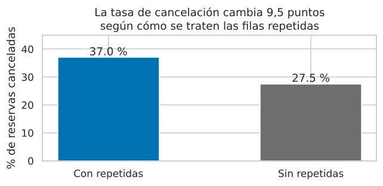
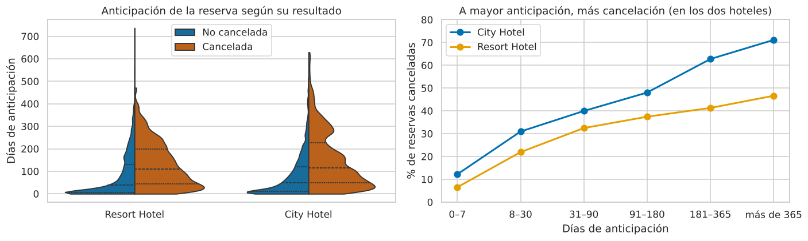
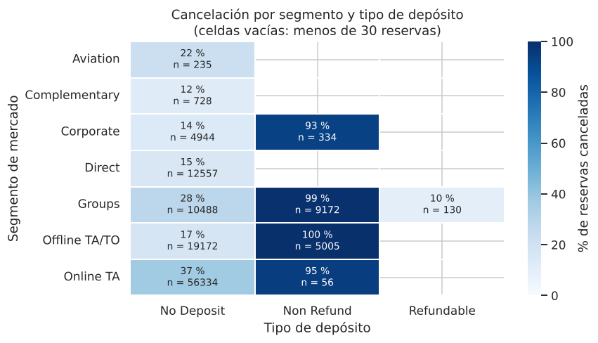

# ¿Por qué se cancela una reserva de hotel?

**Análisis exploratorio, preprocesamiento y reducción de dimensionalidad sobre la base *Hotel Booking Demand***

Evento evaluativo 2 · Análisis de Datos · Instituto Tecnológico Metropolitano (ITM) · Semestre 2026-2
Docente: Daniel Alexis Nieto Mora · **Grupo 4**

| Módulo | Notebook | Responsable |
|---|---|---|
| Fase 1 · Exploración de bases y selección | `01_exploracion_bases.ipynb` | Juana |
| Fase 2 · Calidad de datos y análisis univariado | `02_eda_calidad_univariado.ipynb` | Samuel |
| Fase 2 · Análisis multivariado e hipótesis | `03_eda_multivariado_hipotesis.ipynb` | David |
| Fase 3 · Preprocesamiento y PCA | `04_preprocesamiento_pca.ipynb` | Víctor |

Cada integrante desarrolló su módulo; el historial de commits muestra los aportes de cada uno.

## Pregunta del proyecto

> **¿Qué características de una reserva se asocian con que termine cancelada?**

Trabajamos con 119.390 reservas de dos hoteles de Portugal (un hotel de ciudad en Lisboa y un resort en el Algarve) con llegada entre julio de 2015 y agosto de 2017.

## Estructura del repositorio

```
├── README.md
├── requirements.txt
├── notebooks/
│   ├── 01_exploracion_bases.ipynb            Fase 1: tres bases, tres tipos de dato, matriz de decisión
│   ├── 02_eda_calidad_univariado.ipynb       Fase 2: faltantes, duplicados, atípicos, distribuciones, univariado
│   ├── 03_eda_multivariado_hipotesis.ipynb   Fase 2: relaciones, correlaciones, series de tiempo, 5 pruebas de hipótesis
│   └── 04_preprocesamiento_pca.ipynb         Fase 3: codificación, escalado, PCA, t-SNE y LDA
└── figures/                                  Gráficas clave usadas en este README
```

Los notebooks se leen en orden. El 02 define la función `limpiar()`, que el 03 y el 04 reutilizan sin cambios para que los tres trabajen sobre los mismos datos.

## Cómo ejecutarlo

**En Google Colab (recomendado).** No hay que descargar ni subir archivos: los notebooks leen los datos desde una URL pública.

| Notebook | Abrir |
|---|---|
| 01 · Exploración | [](https://colab.research.google.com/github/samrx21/analisis-datos-evento2-grupo4/blob/main/notebooks/01_exploracion_bases.ipynb) |
| 02 · Calidad y univariado | [](https://colab.research.google.com/github/samrx21/analisis-datos-evento2-grupo4/blob/main/notebooks/02_eda_calidad_univariado.ipynb) |
| 03 · Multivariado e hipótesis | [](https://colab.research.google.com/github/samrx21/analisis-datos-evento2-grupo4/blob/main/notebooks/03_eda_multivariado_hipotesis.ipynb) |
| 04 · Preprocesamiento y PCA | [](https://colab.research.google.com/github/samrx21/analisis-datos-evento2-grupo4/blob/main/notebooks/04_preprocesamiento_pca.ipynb) |

En Colab: *Entorno de ejecución → Ejecutar todas*. Cada notebook tarda menos de un minuto.

**En local.**

```bash
pip install -r requirements.txt
jupyter notebook notebooks/
```

<!-- JUANA: pega tu sección (Fase 1) debajo de esta línea -->

## Fase 2 (parte 1) · Calidad de los datos y análisis univariado

| Problema | Qué encontramos | Decisión |
|---|---|---|
| Faltantes en `company` (94 %) y `agent` (14 %) | No son al azar: significan "no aplica" (reserva sin empresa o sin agencia), y se relacionan con la cancelación | Indicadores `tiene_empresa` y `tiene_agente` |
| Faltantes en `country` (0,4 %) y `children` (4 filas) | Dato no registrado | Categoría "Desconocido" e imputación con la mediana |
| Registros imposibles | 180 reservas sin huéspedes, una tarifa negativa y una de 5.400 € | Eliminación (182 filas, 0,15 %) |
| **Filas repetidas (27 %)** | Concentradas en reservas de grupo y depósitos no reembolsables; la base no trae identificador de reserva | Se conservan y se mide su efecto |
| Atípicos | El criterio IQR falla en variables dominadas por ceros: marca como atípica una de cada cuatro reservas | Decisión variable por variable, no automática |



La tasa global de cancelación pasa de 37,0 % a 27,5 % según se conserven o no las filas repetidas. Esa sensibilidad atraviesa todo el proyecto.

En el análisis univariado, `lead_time` tiene asimetría positiva (media 104 días, mediana 69) y mejora con una transformación logarítmica; `adr` no. Las variables de historial son cero en más del 90 % de los casos.

## Fase 2 (parte 2) · Análisis multivariado e hipótesis



La anticipación es la variable que mejor ordena las reservas: la tasa de cancelación sube de 12 % (reservas de la misma semana) a 71 % (más de un año) en el hotel de ciudad, y el patrón se repite en el resort.



Las reservas no reembolsables se cancelan el 99 % de las veces. No es un efecto del depósito: el 97 % viene de Portugal, el 97 % entra por grupos o agencias tradicionales y el 93 % son filas repetidas. Son reservas en bloque de operadores turísticos.

**Pruebas de hipótesis** (α = 0,01 con corrección de Bonferroni para 5 pruebas):

| Hipótesis | Prueba | Efecto con todas las filas | Efecto sin repetidas | Conclusión |
|---|---|---|---|---|
| H1 Depósito × cancelación | Chi-cuadrado | V = 0,48 | V = 0,16 | Se rechaza H0; la magnitud depende de los duplicados |
| H2 Anticipación según cancelación | t de Welch y Mann-Whitney | d = 0,63 | d = 0,42 | Se rechaza H0; resultado robusto |
| H3 Solicitudes especiales × cancelación | Chi-cuadrado | V = 0,26 | V = 0,13 | Se rechaza H0; resultado robusto |
| H4 Tarifa × cancelación | t sobre r de Pearson | r = 0,048 | r = 0,133 | Se rechaza H0, pero el efecto es despreciable |
| H5 Noches de fin de semana según cancelación | t de Welch | d = −0,003 | d = 0,137 | No se rechaza H0 con todas las filas; se rechaza sin repetidas |

Con 119 mil registros casi todo resulta "significativo", así que reportamos siempre el tamaño del efecto junto al valor p.

<!-- VICTOR: pega tu sección (Fase 3) debajo de esta línea -->

## Hallazgos principales

1. **La anticipación es el mejor indicio de cancelación:** de 12 % a 71 % en el hotel de ciudad; efecto mediano y robusto.
2. **El 99 % de cancelación de las reservas no reembolsables es un efecto de composición,** no del depósito: son reservas en bloque repetidas.
3. **Las filas repetidas (27 %) cambian las conclusiones:** la tasa global pasa de 37 % a 27,5 % y una de las cinco hipótesis cambia de decisión.
4. **Las señales de compromiso reducen la cancelación:** solicitudes especiales (22 % frente a 48 %), reserva directa (15 %), huésped repetido.
5. **El cliente local cancela más que el internacional,** incluso controlando por hotel y por depósito.
6. **El precio casi no se relaciona con la cancelación** (r = 0,05), aunque la prueba sea significativa.
7. **El resort es estacional y el hotel de ciudad no:** la tarifa del resort se multiplica por cuatro en agosto.
8. **PCA comprime poco,** y sus componentes confirman de forma independiente lo que mostró el EDA.

## Dificultades y cómo las resolvimos

- **Filas repetidas sin identificador de reserva.** No podíamos saber si eran errores o reservas reales. En lugar de borrarlas, revisamos dónde se concentraban y repetimos las pruebas con y sin ellas.
- **El criterio IQR marcaba como atípico hasta el 25 % de una variable.** Entendimos que en variables dominadas por ceros el IQR vale cero, y pasamos a decidir variable por variable.
- **Valores p iguales a cero.** Con esta cantidad de datos todo era significativo; incorporamos el tamaño del efecto.
- **Variables con cientos de categorías.** El one-hot no era viable para `country` y `agent`; usamos codificación por frecuencia.
- **PCA con resultados "malos".** La primera lectura fue que algo estaba mal hecho. Al revisarlo contra las correlaciones del EDA, vimos que el resultado era correcto y que decía algo sobre los datos.

## Limitaciones

- Los datos son de dos hoteles de un solo país y de 2015 a 2017: no se pueden generalizar.
- Las pruebas de hipótesis miran una variable a la vez y evalúan asociación, no causalidad.
- PCA supone relaciones lineales y variables continuas; 37 de las 53 columnas finales son indicadores 0/1.

## Uso de herramientas de IA

Usamos un asistente de IA como apoyo para estructurar los notebooks y revisar código. Cada integrante ejecutó su módulo y verificó los resultados contra los datos. Las decisiones de limpieza y las conclusiones son responsabilidad del equipo.

## Referencias

Almeida, T. A., Gómez Hidalgo, J. M., & Yamakami, A. (2011). Contributions to the study of SMS spam filtering: New collection and results. *Proceedings of the 11th ACM Symposium on Document Engineering*, 259–262.

Antonio, N., de Almeida, A., & Nunes, L. (2019). Hotel booking demand datasets. *Data in Brief, 22*, 41–49. https://doi.org/10.1016/j.dib.2018.11.126

Xiao, H., Rasul, K., & Vollgraf, R. (2017). *Fashion-MNIST: A novel image dataset for benchmarking machine learning algorithms*. arXiv:1708.07747.
